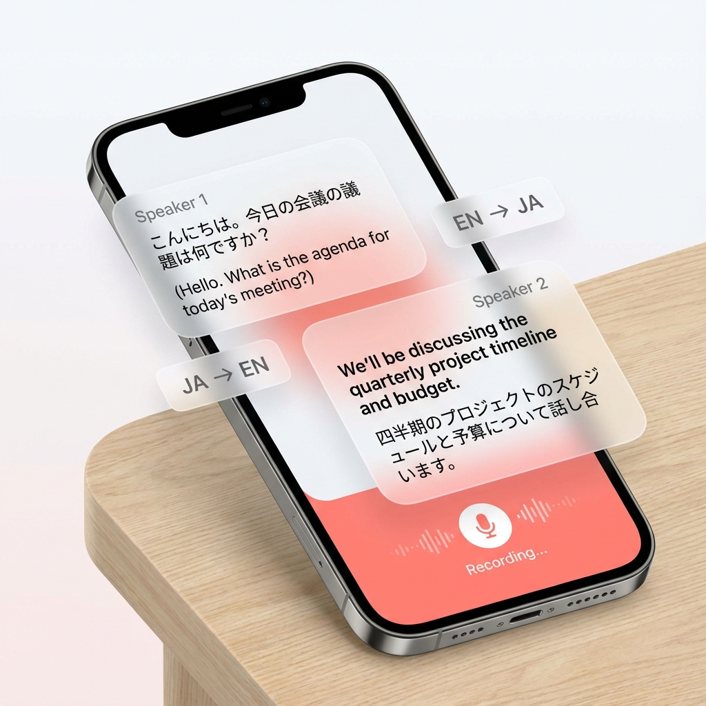

# Aibond（アイボンド）

**言葉の壁を越えて、大切な人との絆を深める**

国際カップルのための会話記録・翻訳支援ツール

[](https://www.typescriptlang.org/)
[](https://nextjs.org/)
[](https://supabase.com/)
[](https://cloud.google.com/)
[](https://opensource.org/licenses/MIT)
[](https://aibond-web-694039525012.asia-northeast1.run.app)

## 概要

Aibondは、国際カップル・夫婦（推定30万組）をターゲットとした会話記録・翻訳支援SaaSです。リアルタイム音声認識と翻訳により、言語の壁を超えたコミュニケーションを支援します。

### 主な特徴

- **リアルタイム文字起こし**: 2人の会話を即座にテキスト化
- **話者識別**: 誰が何を話したかを自動で識別
- **リアルタイム翻訳**: メイン言語からサブ言語へ即座に翻訳
- **AI自動整理**: 会話から「約束したこと」を自動抽出
- **会話履歴管理**: 大切な会話をカテゴリ別に整理・検索

## デモ

🔗 **本番環境**: https://aibond-web-694039525012.asia-northeast1.run.app

## スクリーンショット

### ダッシュボード

*会話履歴とAI分析が表示されるメインダッシュボード*

### リアルタイム翻訳

*リアルタイム音声認識と翻訳の様子*

### AI分析

*AIによる会話の自動要約と約束事の抽出*

## 主な機能

### 1. 会話記録（Talks）
- リアルタイム音声認識による文字起こし
- 話者識別機能
- 多言語翻訳（Google Cloud Translation API）
- 会話履歴の保存と検索

### 2. AI分析
- Google Gemini APIを使用した会話の自動要約
- 「約束したこと」の自動抽出と管理
- 感情分析

### 3. パートナー管理
- カップル間のアカウント連携
- 共有会話履歴
- プライバシー設定

### 4. 多言語対応
- 日本語・英語のUI切り替え
- 音声認識対応言語の拡張

### 5. サブスクリプション
- Stripe統合による決済機能
- 3つの料金プラン（Free/Light/Standard/Premium）
- 使用時間の自動追跡

## 技術スタック

### フロントエンド
- **Next.js 15** - React フレームワーク
- **TypeScript** - 型安全性
- **Tailwind CSS** - スタイリング
- **Radix UI** - アクセシブルなUIコンポーネント
- **shadcn/ui** - UIコンポーネントライブラリ

### バックエンド
- **Next.js API Routes** - サーバーサイドAPI
- **Supabase** - 認証・データベース（PostgreSQL）
- **Supabase Storage** - 音声ファイルストレージ

### AI・音声処理
- **Google Cloud Speech-to-Text** - 音声認識
- **Google Cloud Translation** - 翻訳
- **Google Gemini API** - AI分析・要約
- **Google Cloud Natural Language** - 感情分析

### 決済・課金
- **Stripe** - サブスクリプション管理
- **Stripe Webhooks** - イベント処理

### インフラ
- **Google Cloud Run** - コンテナホスティング
- **Google Cloud Secrets** - シークレット管理
- **Google Cloud Build** - CI/CD
- **Docker** - コンテナ化

## プロジェクト構成

```
Aibond/
├── web/                    # Next.jsアプリケーション
│   ├── src/
│   │   ├── app/           # App Router
│   │   ├── components/    # UIコンポーネント
│   │   ├── lib/           # ユーティリティ・ライブラリ
│   │   └── types/         # TypeScript型定義
│   ├── public/            # 静的ファイル
│   └── Dockerfile         # 本番環境用
├── scripts/               # デプロイスクリプト
├── SPECIFICATION/         # 仕様書
└── documents/            # ドキュメント
```

## テスト

**注意**: このプロジェクトは現在本番稼働中で、すべての主要機能について手動でテストされています。自動テストカバレッジは今後の改善予定です（WIP）。

以下の方法で全機能を検証済みです：
- 手動でのエンドツーエンドテスト
- 本番環境でのモニタリング
- ユーザーフィードバックの統合
- 実際の使用シナリオでの検証

## 開発者

**佐野 智泰（Tomoyasu Sano）**
- GitHub: [@tomoyasu-sano](https://github.com/tomoyasu-sano)
- LinkedIn: [Tomoyasu Sano](https://www.linkedin.com/in/tomoyasu-sano-763723123/)
- Email: anytimes.sano@gmail.com

## ライセンス

このプロジェクトはMITライセンスの下で公開されています。詳細は[LICENSE](LICENSE)ファイルをご覧ください。

## 謝辞

このプロジェクトは以下の技術・サービスを使用しています：
- Next.js
- Supabase
- Google Cloud Platform
- Stripe
